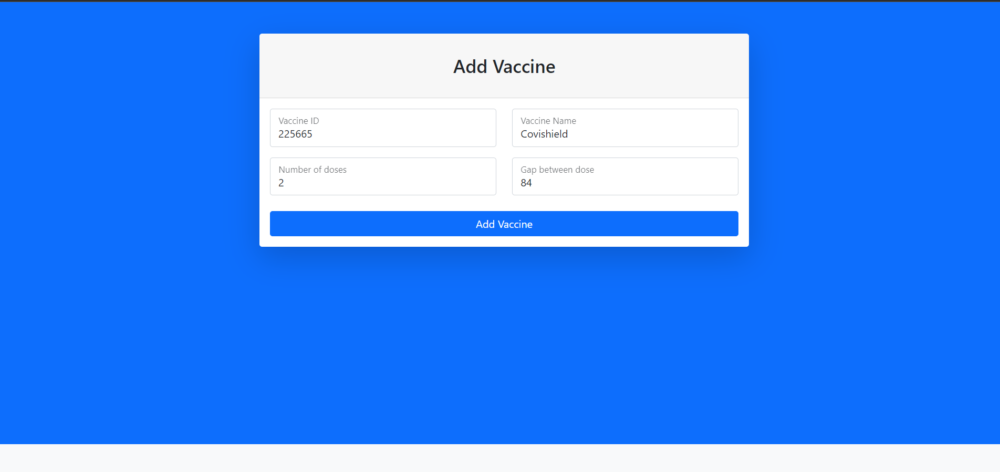
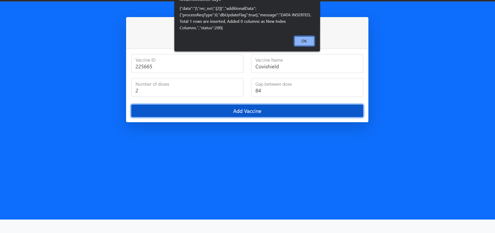
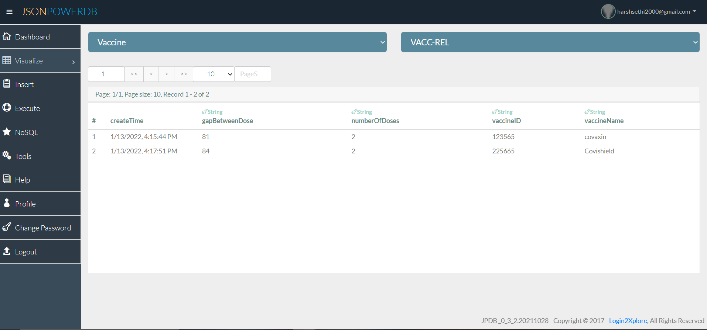

# AddVaccineModule(JsonPoweDB)

This project is about AddVaccineModule which is created using JsonPoweDB.

### About JsonPowerDB:
 JsonPowerDB is a Real-time, High Performance, Lightweight and Simple to Use, Rest API based Multi-mode DBMS. JsonPowerDB has ready to use API for Json document DB, RDBMS, Key-value DB, GeoSpatial DB and Time Series DB functionality. JPDB supports and advocates for true serverless and pluggable API development.
 
### Benefits of using JsonPowerDB:

1. Minimum development cost.
2. Maximum data processing performance.
3. Can be used for any software application that needs backend database.
4. Can be used to to improve existing application performance
5. Technology futuristic , pluggable with new algorithm and with user defined API.

In this project I have created AddVaccineModule which can be used to add vaccines data in our database, In this project I have used JsonPoweDB which help us to create/retrieve data from database without much hustle.

Before staring with JsonPowerDB refer to [Documentation](https://login2explore.com/jpdb/docs.html).

 >Fill form data

>Submit form data

>Check if data is added in JsonPowerDB database

